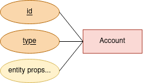
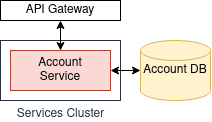

# Account Service

## Specs:
As a consumer, it should be able to manage and fetch Accounts from this Service.

The service should hold Account information of any type with any necessary given properties.

The service should be capable of:
* Create a new Account of a given type
* Update an existing Account of a given type
* Deactivate an (virtual delete) Account of a given type
* Fetch Accounts of a given type

Required index for any given Account:
* id, guid PK
* type, enum PK*

\* Does not necessarily need to be a PK, but as an index it is certainly a required property/field.

## ERD:

## Entity:

## OpenAPI Specs

Find the specification on file [account-api-spec.yml](account-api-spec.yml).

You can visualize the OpenAPI specification for the Account Service in the Swagger online editor https://editor.swagger.io/ .

## Technology Stack

### API - AWS API Gateway

AWS API Gateway has already useful policies for quota and throttling, as well as being able to authenticated with a custom build Authorizer as a Lambda function or with Cognito User Pools. It also has full support to OpenAPI 3.0 specs.

### Service Cluster - AWS Lambda or Kubernetes (Docker containers)

For a public-facing interface only AWS Lambda would be a fair choice, it is fully managed, performatic and cheap regarding given complexity.

For a multi-facing interface (public, internal) Kubernetes would be a wiser choice for the fact of being available internally for other services consuming.

Both of the choices could be easily integrated with API Gateway mentioned above.

### DB - AWS DynamoDB with AWS DynamoDB DAX*

Document DBs are ideal for holding entities with scoped/variable fields/properties.

DynamoDB offers a self-managed DB with broad scaling capabilities built-in, high availability, self-managed backup and easy Point-In-Time restoration tools among many features at a reasonable price.

DynamoDB DAX offers in addition to DynamoDB a self-managed caching layer to increase reading speed and reduced DB throughput.

\* DynamoDB DAX is not a requirement though, other caching strategies could be written (e.g. Redis, Memcached) at the application level.

\*\* Other choices such as MongoDB, CouchDB can be considered as well, but with the drawback of having to manage additional operations.

### Programming Languages - Variable

This is a decision to be taken considering some variables as criteria, such as: Team expertise/growth (market-wise), platform support, delivery treshold, project/product requirements (performance, deployability, etc).

Personally I believe that strong-typed languages with explicit contracts give a better understanding for the developer of the business model. Go and Rust are lightweight and fast, good choices.

I also believe that weak-typed languages gives a lot of flexibility and have a faster pace in the development process. Node.js (JS) and Python are powerful choices.

Disregarding the choice a convention must be in place to ensure caveats on test boundaries, test edge cases, test coverage, coding style, paradigm, etc.

### Infra - Terraform IaC

Infra must be provisioned and managed as code, so states can be traced and optimized. Terraform is a multi-platform provisioning framework working along with AWS Cloudformation.

### CI, CD

Continuous Integration Pipelines must ensure most of the project/team conventions, those who can be automated. Jenkins, Circle CI, Gitlab CI, AWS CodePipeline.
Continuous Deployment Pipelines must have restricted access to its dependenceis (secrets, clusters, etc). The platforms above can be used and when not fully integrated with your infra, automation tools such as Help (k8s), Puppet or Ansible will get your code deployed.
