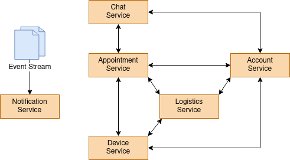

# Monolith Breakdown

## Mapping entities

* Account
* Appointment
* Device

## Required interfaces

Given the provided information, below Entities are being queried and managed by the monolith.

Case 1:

* Appointment, Customer and Fitter information fetch

Case 2:

* Appointment, Customer, Fitter and Device information fetch
* Appointment and Device management

## Data flow scenarios

Given the above cases, following data flows can be considered.

### Apointment scheduling
* Customer schedule an Appointment with Fitter.
* **Logistics shipment to customer** gets triggered
* **Appointment update** gets triggered

### Appointment update
* **Notify Customer about Appointment update** gets triggered for Appointment
* **Notify Fitter about Appointment update** gets triggered for Appointment

### Appointment matching
* A job matches recurring Appointments between Customer and Fitter.
* The job schedule an Appointment between Customer and Fitter.
* **Logistics shipment to customer** gets triggered
* **Appointment update** gets triggered

### Appointment ended
* Fitter informs that Appointment ended.
* **Logistics device retrieval** gets triggered

### Customer sends message to Fitter
* **Notify Fitter about Appointment update** gets triggered for Appointment

### Fitter sends message to Customer
* **Notify Customer about Appointment update** gets triggered for Appointment

### Logistics shipment to Customer
* Logistics creates a shipment order of a Device to get shipped to Customer as a result of the Appointment.
* Partner collects Device, Logistics updates shipment order with tracking info and status.
* Logistics listen to/reads from shipment status changes and updates shipment order status.
* **Appointment update** gets triggered once shipment order status is "delivered".

### Logistics Device retrieval
* Logistics creates a shipment order of a Device to get colleted from Customer as a result of the Appointment.
* **Notify Customer about Appointment update** gets triggered for Appointment
* Partner collects Device, Logistics updates shipment order with tracking info and status.
* Logistics listen to/reads from shipment status changes and updates shipment order status.
* **Appointment update** gets triggered when Logistics registers Device retrieval and close ship order.

### Notify Customer about Appointment update
* Notify Customer about Appointment update

### Notify Fitter about Appointment update
* Notify Fitter about Appointment update

Some not covered flows:
* Appointment rescheduling from Customer or Fitter
* Appointment rescheduling due to Device malfunction
* Appointment approval for Customer and Fitter
* Device lost on delivery or retrieval
* Device delivery outdated for Appointment
* Manual device assignment for an Appointment
* Customer, Fitter and Device availability os Appointment scheduling
* Reminder about appointment
* Among many...

## Responsibility identify and segregation

Some high level domains responsible for providing and managing information were identified and subsequentially tough as services.

Entity Services

* Account Service
* Appointment Service
* Device Service

Support Services

* Logistics Service
* Notification Service
* Chat Service

Where:

* **Account Service** will hold Customer and Fitter operations (as defined in the Account Service challenge)
* **Appointment Service** will be responsible for managing Appointments, dependant on Account and Device Services,
* **Device Service** will hold Device information. Will be dependant on Logistics services to acquire current statuses.
* **Logistics Service** will be responsible for the operations regarding Devices and Appointments.
* **Notification Service** will broadcast notifications on certain ecosystem events. Websocket tunnels as well as any other kind of notification (SMS, E-mail, Push notication) will be handled here.
* **Chat Service** will register incoming message and propagate event to Notification Service that a new msg has arrived. It will not be dependant of any service initially, just dependant of a sticky event streaming.

### SRD

## ERD:

## Decoupling Journey

### Before it starts

Operational Readiness is a pre-requiment before start any decoupling from a monolith, so ensuring ways to integrate, test, deploy, monitor and trace data is a must. Usually it can be achieved while decoupling the first or second service.

### Guiding concepts

It is clever to start by chosing the less-important edge services with minimal dependecy back to the monolith.
Core domains should be avoided in the early stages since it may have huge impact in the business operation in case anything needs to be improved.

Decoupling must be done vertically, so user facing interfaces and the data comes along with the capability. Each service might required different types of DBs for different applications, so redesigns at this stage might happen. A data migration must be taken into consideration when planning a decoupling.

After the early stages/first services, an analysis of what requires changes more often should be made. By decoupling services that requires changes more often the changing and delivery pace increases once it does not have to wait its counterpart monolith.

Not necessarily the whole monolith needs to be taken apart. The decoupling necessity might raise from a need to change, and this can only be achieved by measuring some sort of metric.

### Plan

The Notification Service seems to be a good candidate since it does not hold any sort of data. All the non-functional requirements can be worked for this monolith, CI/CD, Infrastructure, Testing, Monitoring, Tracing, etc.
At this stage some Infrastructure as Code might also be required to provision the Notification Service depencies, such as the Event Streams for instance.

The Chat Service seems to be the less dangerous choice after the ecosystem gets more mature with one Service already running.
The fact it holds non-critical data also helps in the decision. Data migration must be in place. At this stage, an interface must be exposed internally to be consumed by the monolith. Chat requests for the monolith get routed to the Chat Service.

With more experience and the ecosystem more mature, more likely to be changed services should be decoupled next. I am assuming Appointment requires constant improvement due to its high importance.

The migration should keep going on the remaining services until there is no necessity to migrate any further.

At some point public interfaces for each service (which must have one) should be taken as the primary route. For that maybe other edge services might have to be decoupled as well, such as Authentication for instance.

### Reference

Martin's Fowler website - https://martinfowler.com
Domain Driven Design. Tackling Complexity in the Heart of Software by Eric Evans (ongoing reading)
Experience with previous monolith decoupling projects
